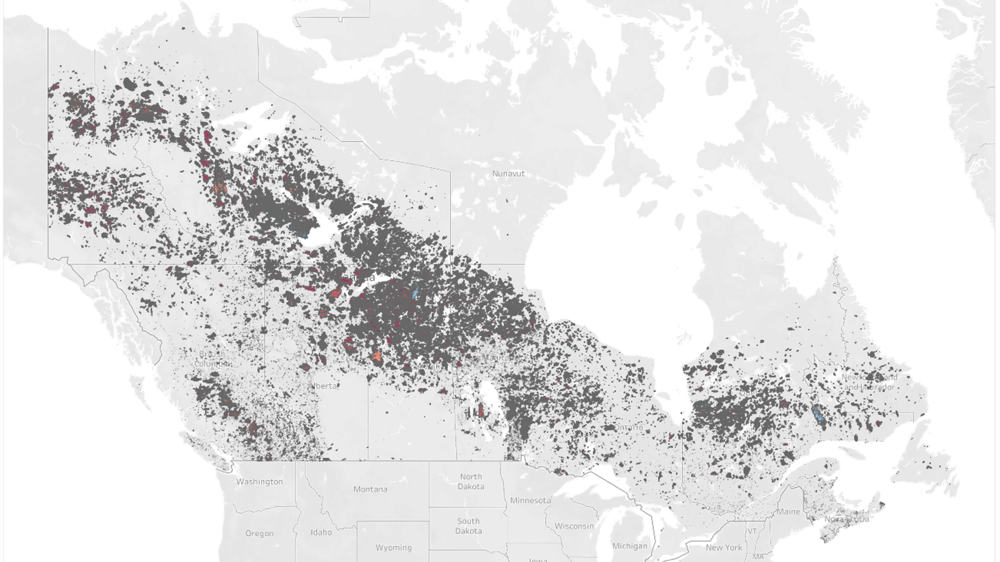

# Capstone-2024
Sari Sarieddine 

This repository is for my Capstone Project

Introduction: 

This project aims to create a model that determines the likelihood of forest fires based on weather projections.

The idea behind this that forest fires are becoming more common-place and more dangerous with the warmer weather and milder winters. 
The goal of this project is to aid communities in better anticipating forest fires, which will help in evacuation and severe weather planning. 

---
Below is a map of all the forest fires that occured between 1990-2022. The model will be using the data collected from all the fires shown below, along with weather data from 266 weather stations.

---
Files: 

converter.ipynb

Description: Responsible for converting .shp files to csv. Exclusively used for the data on forest fires. 

station_filtering.ipyb

Description: Responsible for filtering ~8500 weather stations to determine the ideal stations based on lat and long to use for this project. 

weather_downloader.ipynb

Description: Responsible for downloading the weather data from a government of Canada run public database from the weather stations that were filtered above. 

unzipper.sh
Description: bash file created to unzip large number of zipped files related to historic forest fire data. 

